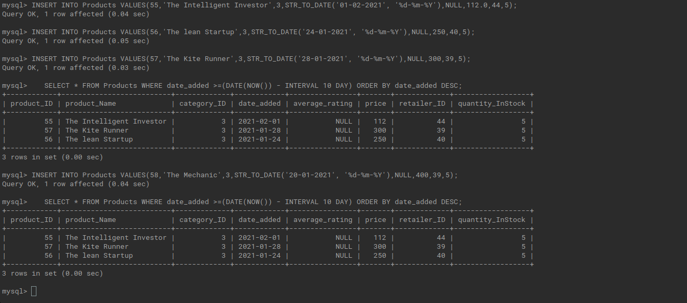

# Assignment 2 <!-- omit in toc -->


## Contents <!-- omit in toc -->
- [Problem 1](#problem-1)
- [Problem 2](#problem-2)
- [Problem 3](#problem-3)
- [Problem 4](#problem-4)
- [Problem 5](#problem-5)
- [Problem 6](#problem-6)
- [Problem 7](#problem-7)
- [Problem 8](#problem-8)
- [Problem 9](#problem-9)
- [Problem 10](#problem-10)
- [Problem 11](#problem-11)
- [Problem 12](#problem-12)
- [Problem 13](#problem-13)
- [Problem 14](#problem-14)
- [Problem 15](#problem-15)
- [Problem 16](#problem-16)
- [Problem 17](#problem-17)
- [Problem 18](#problem-18)
- [Problem 19](#problem-19)
- [Problem 20](#problem-20)
- [Problem 21](#problem-21)
- [References:](#references)


**Design a database schema of an E-commerce platform X.** 

You have to implement the following functionalities available to the customers:

- Search for products.
- Browse through products available on sale.
- Add products to their cart and save them for later.
- Buy products.
- Rate and add reviews for products they bought in the past.
- Browse through their past orders.
- Product recommendation by the platform based on their purchase and search history.

A user can sign up on the platform by using a valid email id (email-verification while inserting it into the database, for example- abcd@gmail.com) and password.

X has a fixed set of retailers in various cities from which it procures products. ( and for simplicity X only sells three types of products - novels, electronics, and clothes). 

Each product contains information about the Retailer from which it was purchased by the platform, along with other information like description, date of manufacture, etc. Product prices are dynamic and can be updated. 

Create a database schema for the above application. Your database must include the name of the tables you have identified, the attributes of the table, and the integrity constraints like Primary key, Foreign key, and NOT NULL. 


Write SQL queries for the following questions. Questions 1-20 carries 2 marks each. Question 21 carries 5 marks. No partial marks for questions 1-21.

----
----
----
#### Problem 1

Fill the tables with at least 20 dummy records. (Please ensure that the database constraints are satisfied.)

**Solution:**       
To insert into a particular table the following code can be used:     

```SQL
INSERT INTO <Table_Name>(<column1>,<column2>,<column3>) VALUES(<value1>,<value2>,<value3>);
```
Twelve tables are filled with dummy variables following all the constraints. The code for the same can be accessed through the following links.

1. [Insert into User table](./Insert/insert_users.sql)
2. [Insert into Retailers table](./Insert/insert_retailers.sql)
3. Insert into product table
   - [Insert items in Clothes Category](./Insert/insert_clothes_product.sql)
   - [Insert items in Electronics Category](./Insert/insert_electronics_product.sql)
   - [Insert items in Novel Category](./Insert/insert_novel_product.sql)
4. [Insert into Delivery Address table](./Insert/insert_delivery_address.sql)
5. [Insert into Order table](./Insert/insert_into_orders.sql)
6. [Insert into History table](./Insert/insert_history.sql)
7. [Insert into Cart table](./Insert/insert_cart.sql)
8. Insert More Product Details into each of the respective tables.
   - [Insert details about clothes](./Insert/insert_cloth_desc.sql)
   - [Insert details about electronics](./Insert/insert_electronics_desc.sql)
   - [Insert details about novels](./Insert/insert_novel_desc.sql)

---
#### Problem 2

Delete a user from the database. After deleting the user update name of the user as ‘Anonymous’ in all the ratings and reviews written by that user.

**Solution:**  
We have an Anonymouse user in the user table to map the Anonymous values created by using the following command. The user_ID 88888 is reserved for Anonymouse users.

```SQL
INSERT INTO Users VALUES(88888,'Anonymous');
```

The ratings and reviews is stored in the order table.Since we need the ratings and reviews, we query all the entries in the order table by this user and change the user_ID to that of the Anonymous User. It can be done Cursor.

```SQL
delimiter $$
create procedure findOrder()
begin 
    declare ordertemp int;
    declare v_finished integer default 0;
    declare orderCursor cursor for select order_number from Orders where user_ID=2; /* this user_ID is the Id of the user which we need to delete*/
    declare continue handler for NOT FOUND set v_finished=1;
    open orderCursor;
    get_order: LOOP
        fetch orderCursor into ordertemp;
        if v_finished=1 then
            leave get_order;
        end if;
        update Orders set user_ID=88888 where order_number=ordertemp;
    END LOOP get_order;
    close orderCursor;
end $$

```

And this procedure can be called using call statement,

```SQL
call findOrder();$$
```

<p align="center">
  
</p>

Now, delete the required User (user_ID=2) from the User table.
<p align="center">
  
</p>


---
#### Problem 3  
Increment the price of all products priced below Rs. 5000 by 10%, which were viewed by more than 10 users in the last 3 months. 

#### Problem 4  

Add 3 new delivery addresses for a user with user_id = 1. 

**Solution**

```SQL
INSERT INTO Delivery_Address(user_ID,city,state,country,Phone,Pin) VALUES((1,'Ahmedabad','Gujarat','India','5472090830','679594'),(1,'Kochi','Kerala','India','7895487896','676503'),(1,'Mumbai','Maharashtra','India','3527484785','368521'));

```


#### Problem 5

Find phone numbers and email IDs of all users who reside in the city ‘Madrid’ and have made a total purchase greater than or equal to Rs. 10000 in the past.

**Solution**

```SQL
select Users.phone,Users.email from Users,Orders,Products where (Orders.user_ID = Users.user_ID and Users.city="Madrid" and Products.product_ID=Orders.product_ID and Products.price*Orders.quantity>10000);
```

<p align="center">
  
</p>


#### Problem 6

Find all products in the database whose name contains the string ‘mi’. E.g. Xiaomi, etc, and all users who bought them at least once. 

**Solution**

LIKE function can be used to find pattern. And the select query can be computed for each of the categories and union them to get the resultant table.

```SQL
select Name,product_ID from Electronics where Name LIKE '%mi%' union all select Name,product_ID from Novels where Name LIKE '%mi%' union all select Name,product_ID from Clothes where Name LIKE '%mi%' ;
```
<p align="center">
  
</p>

Then a table is created to store the results and the respective product id.

```SQL
   create table temp(product_Name varchar(50),product_ID int,user_ID int);
   INSERT INTO temp (product_NAME,product_ID) SELECT Name,product_ID from Electronics where Name LIKE '%mi%';
```
<p align="center">
  
</p>
Now, we can compare the the product_IDs in temp table and Order table to get the user_IDs of the people who at least bought them once.

```SQL
select Orders.user_ID from Orders,temp where Orders.product_ID = temp.product_ID;$$
```
<p align="center">
  
</p>

#### Problem 7

Find all retailers and their email addresses who operate from the city ‘Ahmedabad’.

**Solution**

```SQL
   select * from Retailer where City="Ahmedabad";
```
<p align="center">
  
</p>

#### Problem 8
Find the last 3 orders of the last user. 
Note: The last user is the user who signed up on the platform last. This can be determined by the time & date when the user signed up on the platform.

**Solution**

First, find the user_ID of the last person who signed on the platform using date and time and rearranging in the descending order.

```SQL
select user_ID,date(date_created) as date1,time_created from Users
    -> order by date(date_created)desc,time_created desc;
```

We can see that the user with the user_ID =644 had registered last.


#### Problem 9

Find products in the cart of the first and second users. 

**Solution**

First, let's find out who are the first and second users.

```SQL
   select user_ID,date(date_created) as date1,time_created from Users
    -> order by date(date_created)asc,time_created asc;
```
<p align="center">
  
</p>
User with User_ID 1 and 771 were the first and second users. Now, we can get the product names by comparing the product_IDs from Cart table with that of product table.

```SQL
create table first_user(product_ID int);
create table second_user(product_ID int);
INSERT INTO first_user (product_ID) SELECT product_ID from Cart where user_ID=1;
INSERT INTO second_user (product_ID) SELECT product_ID from Cart where user_ID=771;
select Products.product_Name from Products,first_user where Products.product_ID=first_user.product_ID;
select Products.product_Name from Products,second_user where Products.product_ID=second_user.product_ID;
```

<p align="center">
  
</p>

<p align="center">
  
</p>

#### Problem 10

List all novels published after 2010. 

**Solution**

```SQL
   SELECT * FROM Novels WHERE year_of_publication > '2010';
```
<p align="center">
  
</p>

#### Problem 11

List all electronics products in the price range of 10k-20k.

**Solution**
```SQL
   SELECT * FROM Products WHERE category_ID=2 AND price BETWEEN 10000 AND 20000;
```
<p align="center">
  
</p>
<p align="center">
  
</p>


#### Problem 12

List all users who bought more than 3 electronic items and more than 3 novels. 

**Solution**

Idea, first create a table of user who bought more than 3 electronic items. and another table of users who bought more than 3 novels. Combine both the table using inner join with user_ID as the id.

```SQL
create table electronics_greater(user_ID int,product_Name varchar(50),product_ID int,quantity int);
create table novel_greater(user_ID int,product_Name varchar(50),product_ID int,quantity int);
```

```SQL
INSERT INTO electronics_greater(user_ID,product_Name,product_ID,quantity) SELECT Orders.user_ID,Products.product_Name,Products.product_ID,Orders.quantity from Orders,Products where (Products.product_ID=Orders.product_ID and Products.category_ID=2 and Orders.quantity>3);

INSERT INTO novel_greater(user_ID,product_Name,product_ID,quantity) SELECT Orders.user_ID,Products.product_Name,Products.product_ID,Orders.quantity from Orders,Products where (Products.product_ID=Orders.product_ID and Products.category_ID=3 and Orders.quantity>3);
```

Join using inner join. It is equivalent to intersect in set operation.

```SQL
select distinct user_ID from electronics_greater 
    -> inner join novel_greater using (user_ID);
```
<p align="center">
  
</p>

<p align="center">
  
</p>

#### Problem 13

Sort all laptops according to the price in increasing order.

**Solution**

```SQL
select Products.product_Name,Products.price,Products.product_ID from Products,Electronics where (Products.product_ID = Electronics.product_ID and Electronics.sub_category="Laptop") ORDER BY price DESC;
```
<p align="center">
  
</p>

#### Problem 14

List all products that were added to the database after 11/11/2011.

**Solution**

```SQL
SELECT * FROM Products WHERE date_added >="2011-11-11" ORDER BY date_added ASC;

```
The query is ordered in the ascending order of the date added.
<p align="center">
  
</p>


#### Problem 15

List all novels authored by ‘Dan Brown’. 

**Solution**

```SQL
   select * from Novels where author="Dan Brown";
```

<p align="center">
  
</p>


#### Problem 16

Print the UserId, mobile number, and Email Id of all users who have saved a product in the cart, whose quantity is less than 5.

**Solution**

```SQL
delimiter $$
create procedure findUser()
begin 
    declare userTemp int;
    declare v_finished integer default 0;
    declare userCursor cursor for select user_ID from Cart where quantity<5;

    declare continue handler for NOT FOUND set v_finished=1;
    create temporary table user_temp(user_ID int,mobile_number varchar(50),email varchar(50));
    
    
    open userCursor;

    get_user: LOOP
        fetch userCursor into userTemp;
        if v_finished=1 then
            leave get_user;
        end if;
        /* INSERT INTO user_temp(user_ID,mobile_number,email)*/
         select user_ID,phone,email from Users where user_ID=userTemp; 
    END LOOP get_user;
    
    close userCursor;
end $$
```

#### Problem 17

Find the order with the maximum number of products.

**Solution**

MAX Function can be used to find the maximum quantity in a column and it can be given as a condition for querying.

```SQL
   select * from Orders where quantity = (select MAX(quantity) from Orders);
```
<p align="center">
  
</p>

#### Problem 18

List all products added to the database in the past 10 days.

**Solution**

```SQL
SELECT * FROM Products WHERE date_added >=(DATE(NOW()) - INTERVAL 10 DAY) ORDER BY date_added DESC;
```

The query is accurate and is validated by inserting 3 entries within 10 days and 1 entry outside the 10 day gap. And it correctly showed the book added within a span of 10 days from today (03/02/2021).

<p align="center">
  
</p>


#### Problem 19

List all retailer ids whose products, user_id = 1 have purchased.

**Solution**

First list all the orders which the user has purchased. Then, go through each of the product_IDs and print their retailer_ID.

```SQL
   delimiter $$
create procedure findRetail()
begin 
    declare product_temp int;
    declare v_finished integer default 0;
    declare productCursor cursor for select product_ID from Orders where user_ID=1;
    declare continue handler for NOT FOUND set v_finished=1;
    create table retailer(retailer_ID int);
    open productCursor;

    get_retail: LOOP
        fetch productCursor into product_temp;
        if v_finished=1 then
            leave get_retail;
        end if;
        INSERT INTO retailer(retailer_ID) select retailer_ID from Products where product_ID=product_temp;
        
    END LOOP get_retail;
   select * from retailer;

    close productCursor;
end $$
```
<p align="center">
  
</p>

#### Problem 20

Write a query to update the discount on all new products by 15% and store it as a new table holi_Deals.
Note: Any product that is added to the database in the last 100 days is considered to be a new product.

**Solution**

First a new table is created named holi_Deals with the required attributes using the code below.

```sql
CREATE TABLE holi_Deals (product_ID int,product_Name varchar(50),category_ID int,date_added date,price float(2),retailer_ID int);

```

First query the product added after 100 days. 

```sql
   SELECT * FROM Products WHERE date_added >=(DATE(NOW()) - INTERVAL 100 DAY) ORDER BY date_added DESC;
```

Now copy this into the table created using INSERT INTO function. The discount of 15% can be given while inserting into this table.

```sql
INSERT INTO holi_Deals (product_ID,product_Name,category_ID,date_added,price,retailer_ID) SELECT product_ID,product_Name,category_ID,date_added,price*0.85,retailer_ID from Products WHERE date_added >=(DATE(NOW()) - INTERVAL 100 DAY) ORDER BY date_added DESC;

```

<p align="center">
  
</p>

#### Problem 21

List the top 10 recommended products for the user_id=1 based on the user’s purchase and search history(use any recommendation algorithm).

**Solution**

- Items the user had bought already are as follows and can be obtained by:

```SQL
   select Orders.product_ID,Products.product_Name from Orders,Products where (Orders.product_ID=Products.product_ID and Orders.user_ID=1);
```

<p align="center">
  
</p>

- List of items present in the users Cart.

```SQL
   select Cart.product_ID,Products.product_Name from Cart,Products where (Cart.product_ID=Products.product_ID and Cart.user_ID=1);
```
<p align="center">
  
</p>

**Recommendation Algorithm**

- He had given five start rating to both Asus Vivobook Ultra K14 and Relaxed Jeans. We could recommend the some top products from the orders of other user who had bought these two. 
  
- He has bought past a Samsung Phone and is not satisfied by the purchase which is clear from the rating given by him for the same.

- Comparing it with the previous knowledge and the items in the cart, it would be ideal to recommend him a mobile phones of electronics category.


- Remarks:

   - Unfortunately only this user had bought the items which he gave five star. So, that road is closed.
   
      ```SQL
      select * from Orders where (product_ID = 22);
      select * from Orders where (product_ID = 52);
      select * from Orders where (product_ID = 19);
      ```
   <p align="center">
  
</p>

  - We could recommend some of the items purchased by user_ID 7 who has bought Iphone in the past.

   - Top 10 recommendations:
      1. Apple Iphone SE
      2. Mi Notebook Horizon 
      3. Dell Inspiron 3452
      4. Tommy Hilfiger: Mens Regular fit formal shirt
      5. Ptron Boom
      6. The Fountainhead 
      7. Zebronics Zeb Thunder
      8. Xiaomi Redmi Note 10 Pro
      9. Huawei Air
      10. Slim Fit Denim Jeans
  
      ```SQL
      select Products.product_Name from Orders,Products where (Products.product_ID=Orders.product_ID and Orders.user_ID = 7);

      ```

   <p align="center">
  
</p>

#### References:

1. https://www.youtube.com/watch?v=9z6ouWK5_l0