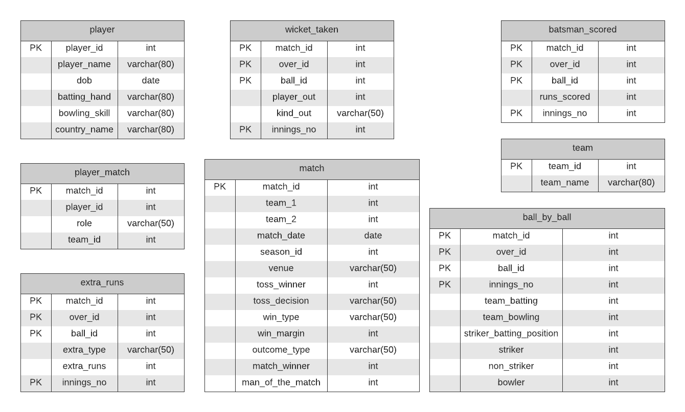
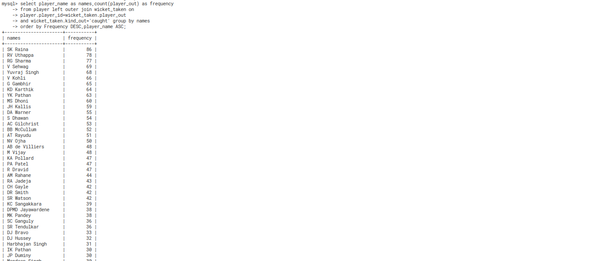

# Mohamed Shamir | 17110084 <!-- omit in toc -->
---


<span style="color:red">Note: Please visit the github repository for codes. [Link]()</span>.

## Contents <!-- omit in toc -->

- [Database Schema](#database-schema)
  - [Creating the database](#creating-the-database)
  - [Get output in CSV](#get-output-in-csv)
- [Problem 1](#problem-1)
- [Problem 2](#problem-2)
- [Problem 3](#problem-3)
- [Problem 4](#problem-4)

---
---

### Database Schema

The Schema for the following problems is as shown below. The integrity constraints are also mentioned in the diagram.



#### Creating the database

- Python Scripts are used to generate sql insertion codes.
- Python Script can be accessed using this [Link](data_insert.ipynb)
- All the sql insertion codes are avalible in the [insert directory.](./insert)

```bash

├── create_table.sql
├── data_insert.ipynb
├── dataset
│   ├── ball_by_ball.csv
│   ├── batsman_scored.csv
│   ├── extra_runs.csv
│   ├── match.csv
│   ├── player.csv
│   ├── player_match.csv
│   ├── team.csv
│   └── wicket_taken.csv
├── images
│   └── schema.png
├── insert
│   ├── ball_by_ball.sql
│   ├── batsman_scored.sql
│   ├── extra_runs.sql
│   ├── match.sql
│   ├── player_match.sql
│   ├── player.sql
│   ├── team.sql
│   └── wicket_taken.sql
├── readme.md
└── run_all.sh

```


- To create the database and insert all the data. Run run_all.sh

```bash
  source run_all.sh
```
#### Get output in CSV


```bash
sudo mysql < ./sql_queries/Q1b.sql| sed 's/\t/,/g' > ./results/Q1b.csv
```

### Problem 1
Write SQL queries for the following questions. Questions ‘a’ to ‘g’ carry 2 marks each. Questions ‘h’-’j’ carry 1 mark each. (17 marks+5 marks) 

**Note:** Required output attribute(s) are given next to each query, also export each output in Q1X.csv, where X is a,b...j. 
Any deviation from the given format would result in zero marks.

<br>
<br>
a. For all the matches_id(entire IPL), find the minimum runs scored in any over and the bowler who bowled that over. Sort by increasing match_id, followed by increasing innings_no, then finally by increasing over_ids. Output: < bowler_name >< runs_scored >    

**Note:** Runs scored in an over is the sum of the batsmen_scored+ extra_runs(wides and "no_balls" only. It should not be match specific)

**Solution:**
```SQL
select player.player_name as bowler_name, last.runs_scored
from
(select FINAL.bowler,min(FINAL.runs_given) runs_scored
from
(select C.bowler,C.match_id,C.innings_no,C.over_id,
SUM(C.runs) runs_given
from
(select B.match_id,B.over_id,B.ball_id,B.innings_no,B.runs,
ball_by_ball.bowler
from
(select A.match_id,A.over_id,A.ball_id,A.innings_no,A.runs
from
(select batsman_scored.match_id,batsman_scored.over_id,
batsman_scored.ball_id,batsman_scored.innings_no,
batsman_scored.runs_scored+ifnull(0,extra_runs.extra_runs) runs
 from batsman_scored left outer join extra_runs
on batsman_scored.match_id=extra_runs.match_id
and batsman_scored.over_id=extra_runs.over_id
and batsman_scored.ball_id=extra_runs.ball_id
and batsman_scored.innings_no=extra_runs.innings_no) as A 
inner join match_details on
match_details.match_id=A.match_id) as B
inner join ball_by_ball
on
ball_by_ball.match_id=B.match_id
and ball_by_ball.over_id=B.over_id
and ball_by_ball.innings_no=B.innings_no
and ball_by_ball.ball_id=B.ball_id) as C
group by C.bowler,C.match_id,C.innings_no,C.over_id 
order by runs_given asc,C.match_id,C.innings_no,C.over_id) as FINAL
group by FINAL.bowler) as last
inner join player
on
player.player_id=last.bowler order by runs_scored;
```


- SQL Query file for the same. [Link](./sql_queries/Q1a.sql)
- Result file. [Link](./results/Q1a.csv)

b. Find the names of all the batsmen(players) and the frequency of their “caught” out in increasing order of the number of “caught”. If a tie occurs, sort names alphabetically. Hint: Frequency can be 0 too.< names >< frequency >

**Dont forget to come back fix the zero issue**

**Solution:**
```SQL
select player_name as name,count(player_out) as frequency 
from player inner join wicket_taken on
player.player_id=wicket_taken.player_out 
and wicket_taken.kind_out='caught' group by player_out 
order by Frequency DESC,player_name ASC;
```




- SQL Query file for the same. [Link](./sql_queries/Q1b.sql)
- Result file. [Link](./results/Q1b.csv)

c. List the stadium(s)  where the maximum number of “legbyes” (runs) is taken. If ties occur, show alphabetical order. <venue_name><number_of_legbye_runs>

```SQL
select venue as venue_name,SUM(extra_runs.extra_runs) number_of_legbye_runs
from extra_runs inner join match_details on match_details.match_id=extra_runs.match_id 
and extra_runs.extra_type='legbyes' group by venue having SUM(extra_runs.extra_runs)=(select max(Total_Legbye_Runs ) maximum_legbye from 
(select match_details.venue,SUM(extra_runs.extra_runs) as Total_Legbye_Runs
from extra_runs,match_details where match_details.match_id=extra_runs.match_id 
and extra_runs.extra_type='legbyes' group by match_details.venue ) as K) order by venue;
```


- SQL Query file for the same. [Link](./sql_queries/Q1c.sql)
- Result file. [Link](./results/Q1c.csv)

d. Find the bowler(s)(players) who has the best average(no. of runs given/wickets taken) in edition 5. If a tie occurs, sort names alphabetically. < bowler_name >< average >

**Solution:**
```SQL
select player.player_name,FINAL.average
from
(select RUNS_GIVEN.bowler,RUNS_GIVEN.runs_given/ifnull(1,WICKET_TAKEN.wickets)
average
from
(select C.bowler, SUM(C.runs) runs_given
from
(select B.match_id,B.over_id,B.ball_id,B.innings_no,B.runs,
ball_by_ball.bowler
from
(select A.If,A.over_id,A.ball_id,A.innings_no,A.runs
from
(select batsman_scored.match_id,batsman_scored.over_id,
batsman_scored.ball_id,batsman_scored.innings_no,
batsman_scored.runs_scored+ifnull(0,extra_runs.extra_runs) runs
 from batsman_scored left outer join extra_runs
on batsman_scored.match_id=extra_runs.match_id
and batsman_scored.over_id=extra_runs.over_id
and batsman_scored.ball_id=extra_runs.ball_id
and batsman_scored.innings_no=extra_runs.innings_no) as A 
inner join match_details on
match_details.season_id=5
and
match_details.match_id=A.match_id) as B
inner join ball_by_ball
on
ball_by_ball.match_id=B.match_id
and ball_by_ball.over_id=B.over_id
and ball_by_ball.innings_no=B.innings_no
and ball_by_ball.ball_id=B.ball_id) as C
group by C.bowler) as RUNS_GIVEN
left outer join
(select B.bowler,COUNT(B.match_id) wickets
from
(select A.match_id,A.over_id,
A.ball_id,A.innings_no,ball_by_ball.bowler
from
(select wicket_taken.match_id,wicket_taken.over_id,
wicket_taken.ball_id,wicket_taken.innings_no
from wicket_taken inner join match_details
on wicket_taken.match_id=match_details.match_id
and match_details.season_id=5) as A
inner join ball_by_ball
on
ball_by_ball.match_id=A.match_id
and ball_by_ball.over_id=A.over_id
and ball_by_ball.innings_no=A.innings_no
and ball_by_ball.ball_id=A.ball_id) as B
group by B.bowler) as WICKET_TAKEN on
WICKET_TAKEN.bowler=RUNS_GIVEN.bowler) as FINAL
inner join player on 
FINAL.bowler= player.player_id order by
FINAL.average ASC,player.player_name ASC;
```


- SQL Query file for the same. [Link](./sql_queries/Q1d.sql)
- Result file. [Link](./results/Q1d.csv)

e. Find out the names of all batsmen(players) who scored more than 100 runs in a match and, their runs scored. Sort names alphabetically. (if multiple entries of the same player, show the one with the highest runs).< batsmen_name >< runs >

**Solution:**
```SQL
select C.player_name as batsmen_name,max(C.Total_runs) runs from
(select P.match_id,P.player_name,P.Total_runs from
(select K.match_id,K.player_name,SUM(K.runs_scored) Total_runs
from
(select B.match_id,B.runs_scored,player.player_name from
(select ball_by_ball.match_id,
batsman_scored.runs_scored, ball_by_ball.striker
from ball_by_ball left outer join batsman_scored
on batsman_scored.match_id=ball_by_ball.match_id
and batsman_scored.over_id=ball_by_ball.over_id
and batsman_scored.ball_id=ball_by_ball.ball_id
and batsman_scored.innings_no=ball_by_ball.innings_no) as B
left outer join player on
B.striker=player.player_id) as K
group by K.match_id,K.player_name) as P where P.Total_runs>100) as C
group by C.player_name order by C.player_name ASC;
```


- SQL Query file for the same. [Link](./sql_queries/Q1e.sql)
- Result file. [Link](./results/Q1e.csv)

f. Find out the top 3 batsmen(players) whose [number of runs scored/number of matches played] is the best in edition 2. Sort alphabetically. < batsman_name >< value >

**Solution**

```SQL
select player.player_name as batsman_name,D.value
from
(select C.striker,SUM(C.runs_scored)/COUNT(C.match_id) value
from
(select B.match_id,B.striker,SUM(B.runs_scored) runs_scored
from
(select A.match_id,A.striker,batsman_scored.runs_scored
from
(select ball_by_ball.match_id,ball_by_ball.over_id,
ball_by_ball.ball_id, ball_by_ball.innings_no,
ball_by_ball.striker
from ball_by_ball inner join match_details
on ball_by_ball.match_id=match_details.match_id
and match_details.season_id=2) as A
inner join batsman_scored
on 
A.match_id=batsman_scored.match_id
and A.over_id=batsman_scored.over_id
and A.ball_id=batsman_scored.ball_id
and A.innings_no = batsman_scored.innings_no) as B
group by B.match_id,B.striker) as C
group by C.striker order by value desc limit 3) as D
inner join
player on
player.player_id=D.striker;
```


- SQL Query file for the same. [Link](./sql_queries/Q1f.sql)
- Result file. [Link](./results/Q1f.csv)

g. Find out the batting average(as calculated in the above question (f)) of all players. Then only show the list of the top 3 countries with the highest country batting average(∑batting average/Total number of players in that country) < country >< value >

**Solution:**

- To calculate the batting average for all the players

```SQL
select player.player_name as batsman_name,D.value
from
(select C.striker,SUM(C.runs_scored)/COUNT(C.match_id) value
from
(select B.match_id,B.striker,SUM(B.runs_scored) runs_scored
from
(select A.match_id,A.striker,batsman_scored.runs_scored
from
ball_by_ball as A
inner join batsman_scored
on 
A.match_id=batsman_scored.match_id
and A.over_id=batsman_scored.over_id
and A.ball_id=batsman_scored.ball_id
and A.innings_no = batsman_scored.innings_no) as B
group by B.match_id,B.striker) as C
group by C.striker order by value desc) as D
inner join
player on
player.player_id=D.striker
order by value;
```


- Top 3 countries of highest batting average.
  
```SQL
select E.country_name as country,sum(E.batting_average)/count(E.country_name) value
from
(select player.player_name as batsman_name,D.striker,D.batting_average,player.country_name
from
(select C.striker,SUM(C.runs_scored)/COUNT(C.match_id) batting_average
from
(select B.match_id,B.striker,SUM(B.runs_scored) runs_scored
from
(select A.match_id,A.striker,batsman_scored.runs_scored
from
ball_by_ball as A
inner join batsman_scored
on 
A.match_id=batsman_scored.match_id
and A.over_id=batsman_scored.over_id
and A.ball_id=batsman_scored.ball_id
and A.innings_no = batsman_scored.innings_no) as B
group by B.match_id,B.striker) as C
group by C.striker order by batting_average desc) as D
inner join
player on
player.player_id=D.striker) as E
group by E.country_name order by value DESC limit 3;
```


- SQL Query file for the same. [Link](./sql_queries/Q1g.sql)
- Result file. [Link](./results/Q1g.csv)


h. Write down a simple query to make a copy of the player table(with data).

```SQL
create table player_new as SELECT * from player;
```


i. Using view, create a table say “Indian Players” which contains information about the total runs scored by all the Indian players till now and sort them alphabetically.< name >< runs >

**Solution:**

j. List all captains who scored more than 50 runs in edition 3.  Sort names alphabetically < name >< runs >

**Solution:**
```SQL
select player.player_name as name,D.runs
from
(select C.striker,max(C.runs) runs
from
(select B.striker,SUM(B.runs_scored) runs
from
(select A.match_id,A.striker,batsman_scored.runs_scored
from
(select ball_by_ball.match_id,ball_by_ball.over_id,
ball_by_ball.ball_id, ball_by_ball.innings_no,
ball_by_ball.striker
from ball_by_ball inner join match_details
on ball_by_ball.match_id=match_details.match_id
and match_details.season_id=3) as A
inner join batsman_scored
on 
A.match_id=batsman_scored.match_id
and A.over_id=batsman_scored.over_id
and A.ball_id=batsman_scored.ball_id
and A.innings_no = batsman_scored.innings_no) as B
group by B.striker) as C
inner join player_match on
C.striker = player_match.player_id
and player_match.role="Captain"
and C.runs>50 group by C.striker) as D
inner join player on
player.player_id = D.striker order by player_name;
```


- SQL Query file for the same. [Link](./sql_queries/Q1j.sql)
- Result file. [Link](./results/Q1j.csv)


### Problem 2
Suppose a user creates a new relation r1 with a foreign key referencing another relation r2. What authorization privilege does the user need on r2? Why should this not simply be allowed without any such authorization? (max 500 words) (4 marks)

**Solution:**
- References privilege is to be obtained on the the relation r2.
- It is needed for the smooth functioning when the database is operated by different users. If the user in the given question, creates a foreign key relation referencing r2. Then, if the admin wants to make some changes in the r1, the foreign key would create problems in altering unless some specific constraints are not set by the relation r1 while defining the foreign key. In order to avoid this, difficulty reference previlege is introduced, here the admin would be knowing who all have created foreign key relations and can eleminate them for the easy operations by other users on the same relation r2.

### Problem 3
Explain the difference between integrity constraints and authorization constraints. (explain them with examples) (max 500 words) (4 marks)

**Solution:**   
- Integrity Constraints ensures the data is inserted, updated or deleted in a certain manner so that it follows certain set of rules. It can be divided into two: Constraints on Single Relations and Constraints on Multiple Relation.
  - The important integrity constraints include Not NULL, Unique ,Check < predicate >. Not NULL ensures the cell will always be non empty while inserting. If the specific cell is empty, it would throw an error. Unique constraint make sures the uniqueness of an item in a column in a database. One could use Check < predictate > to customly decide to follow certain conditions while inserting the data. For eg: if you have semester as an attribute, one could check, insert the semester data if it is present either in one of Fall,Winter,Spring or Summer period. 
  - Referential Integrity constraints maintains the data integrity in opertaions involving foreign keys in a database. It is an example of constraint on Multiple Relation. By default foreign key references the primary attributes of the referenced table. If there are more attributes referenced by a foreign key. Then it either need to be specified as primary key or a unique constraint needs to be added to that.

- An authorization constraint gives the database administrator the ability to control the authority of various users to do different operations on the databases. Some form of authorization include, permission to read data,permission to insert new data,permission to update data,permission to delete data and many more. Each of these authorizations is called a previlege. 
  - An example can be a database system in IIT Gandhinagar where database admins provide read,write,update,delete permission to the Academic Office and Read access to Students. 
  - It can be controlled using the commands **grant** and **revoke**.

### Problem 4
Consider a set of users A, B, C, D, and E. Suppose the user A creates a table T and thus is the owner of T. Now suppose the following set of statements is executed in order:

1. User A: grant select on T to B, C with grant option
2. User B: grant select on T to C
3. User C: grant select on T to D, E
4. User A: grant select on T to E
5. User A: revoke select on T from B restrict
6. User A: revoke select on T from C cascade


- When does D not have SELECT ON T privilege? Justify your answer. (3 marks)
- What permissions does C have at the end of statement 5? Justify your answer.
(2 marks)

**Solution:**


- **In Step 6**, **D** does not have the SELCT ON T previlege. At first, A had revoked permission on B with "restrict". Since A used restrict, and C (the permission given by B) has a direct connection from A, the perimission to B is revoked. If there C did not have a permission from some one else other than B, then A would not be able to revode the permission of B using restrict. In step 6, A revoked the permission of C using cascade, since it is cascade all the permissions given by C and its children need to be revoked forcefully. E retains its permission through the direct permission given by A while D losses its permission since it did not have any permission from anyone else other than C.
- C had SELECT ON T with Grant Previlege. Since, the permission was given by A directly and has not yet revoked by A.