# Mohamed Shamir | 17110084 <!-- omit in toc -->
---
<span style="color:red">Note: Please visit the github repository for codes. [Link](https://github.com/mshamir11/databaseAssignments/tree/master/Assignment%204)</span>.

## Contents <!-- omit in toc -->
- [Questions:](#questions)
  - [Problem 1](#problem-1)
    - [1](#1)
    - [2](#2)
    - [3](#3)
    - [5.](#5)
    - [6](#6)
    - [13](#13)
    - [16](#16)
    - [19](#19)
    - [20](#20)
    - [21](#21)
  - [Problem 2](#problem-2)
- [References:](#references)
- [Useful Materials:](#useful-materials)
- [Problems Bumped in and Fixes:](#problems-bumped-in-and-fixes)


---
<br>

## Questions:

### Problem 1

Implement the backend connectors for the E-Commerce database created in ​Assignment 2​. 

1. Ensure that ​input sanitization checks are performed. 
2. Submit a method definition for ​Question [1, 2, 3, 5, 6, 13, 16,  19, 20, 21] of the SQL queries implemented in Assignment 2, i.e., you have to holi_Deals a python function as a solution for each question. It must perform the task as per the question.       

    Ex: If a query is  “ insert name and roll number in STUDENT table. “


```python
# Solution

  def insert_data(name, roll_num, tablename, dbconnector, dbname):
    
    dummy_query = ‘insert into {0}(name, rollnum) values({1},{2})’.format(tablename, name, roll_num)
    
    dbconnector.update(dbname, dummy_query)
# Here input sanitization is not performed
```

**Solution:**

- [Jupyter Notebook Link](./python_scripts/1_problem.ipynb)

Python Functions:

#### 1
Fill the tables with at least 20 dummy records.


```python

class fill_tables:

  def __init__(self,mydb):
    self.cursor=mydb.cursor()
    self.mydb = mydb

  def insert_into_user_table(self,user_id,user_name,email,pasw,city,state,country,phone,doj,toj):

    query= """
    INSERT INTO Users VALUES(%s,%s,
    %s,%s,%s,
    %s,%s,%s, %s,%s);
    """

    self.cursor.execute(query,(user_id,user_name,email,pasw,city,state,country,phone,doj,toj))
    self.mydb.commit()


  def insert_into_retailer_table(self,user_name,email,city,state,country):

    query= """
      INSERT INTO Retailer VALUES(%s,%s,%s,%s,%s);

      """

    self.cursor.execute(query,(user_name,email,city,state,country))
    self.mydb.commit()

  def insert_into_delivery_address(self,user_ID,city,country,india,phone,pin):

    query= """
    INSERT INTO Delivery_Address(user_ID,city,state,country,Phone,Pin) VALUES(%s,%s,%s,%s,%s,%s);
    """

    self.cursor.execute(query,(user_ID,city,country,india,phone,pin))
    self.mydb.commit()

  def insert_into_order_table(self,product_ID,user_ID,order_Date,order_time,address_ID,quantity,rating,review):

    query= """
    INSERT INTO Orders(product_ID,user_ID,order_Date,order_Time,address_ID,quantity,rating,review) VALUES(%s,%s,%s,%s,%s,%s,%s,%s);

    """

    self.cursor.execute(query,(product_ID,user_ID,order_Date,order_time,address_ID,quantity,rating,review))
    self.mydb.commit()

  def insert_into_history_table(self,product_ID,user_ID,No_of_visites):

    query="""
    INSERT INTO History(user_ID,product_ID,No_of_visits) 
    VALUES(%s,%s,%s);
    """

    self.cursor.execute(query,(product_ID,user_ID,No_of_visites))
    self.mydb.commit()

  
  def insert_into_cart_table(self,user_ID,product_ID,quantity):
      query = """
       INSERT INTO Cart(user_ID,product_ID,quantity) 
       VALUES(%s,%s,%s);
      """

      self.cursor.execute(query,(user_ID,product_ID,quantity))
      self.mydb.commit()


  def insert_into_product_details(self,tablename,product_name,category_id,date_added,rating,price,retailer_id,quantity_stock):

      
      query="""
      INSERT INTO %s VALUES(%s,%s,%s,%s,%s,%s,%s);
      """

      self.cursor.execute(query,(tablename,product_name,category_id,date_added,rating,price,retailer_id,quantity_stock))
      self.mydb.commit()


```

```python
# How to call the function
import mysql.connector

mydb = mysql.connector.connect(
    host="localhost",
    user="temp",
    passwd="password",
    database ="ecommerce"
    
)

mycursor = mydb.cursor()


insert = fill_tables(mydb)
insert.insert_into_user_table('10000','shamir','shamir@gmail.com','passw','Ahmedabad','Gujarat','India','1234567890','2021-02-23','2330')

```

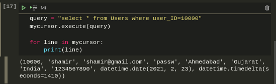

#### 2
Delete a user from the database. After deleting the user update name of the user as ‘Anonymous’ in all the ratings and reviews written by that user.

**Solution:**   
Here user with user_ID=88888 is anonymous. When a particular user is deleted from the database, their order details are updated to user_ID 88888 before deletion to preserve the ratings and reviews as anonymous user.

```python
def delete_from_user(mydb,user_ID):

    query0="""
    SET foreign_key_checks = 0;
    """
    query1="""
    update Orders set user_ID=88888 where user_ID = %s;"""

    query2 = """
    delete from Users where user_ID= %s;"""

    query3="""
    SET foreign_key_checks = 1;
    """
    mycursor= mydb.cursor()
    mycursor.execute(query0)
    mycursor.execute(query1,(user_ID,))
    mycursor.execute(query2,(user_ID,))
    mycursor.execute(query3)
    mydb.commit()

```

```python
""" 
Example on how to call
Here 4 is the user_ID of the user who is getting deleted.
"""

delete_from_user(mydb,4)
```

#### 3
 Increment the price of all products priced below Rs. 5000 by 10%, which were viewed by more than 10 users in the last 3 months. 

**Solution:**


- Original SQL query:
```SQL
update Products
inner join 
(select B.product_ID,B.price,count(B.date_visited) as Views
from
(select A.product_ID,A.date_visited,A.price
from
(select Products.product_ID, Products.price,
History.user_ID,History.date_visited from
History inner join Products
on Products.product_ID =History.product_ID
and Products.price<5000) as A
where A.date_visited> now()- INTERVAL 3 month) as B
group by B.product_ID) as C
on Products.product_ID=C.product_ID
and C.Views>10
set Products.price=1.1*Products.price;
```

- Python Mysql
  
```python
def increase_price(mydb,price_limit,interval,view_limit,percentage_increase):

    query="""

        update Products
        inner join 
        (select B.product_ID,B.price,count(B.date_visited) as Views
        from
        (select A.product_ID,A.date_visited,A.price
        from
        (select Products.product_ID, Products.price,
        History.user_ID,History.date_visited from
        History inner join Products
        on Products.product_ID =History.product_ID
        and Products.price<%s) as A
        where A.date_visited> now()- INTERVAL %s month) as B
        group by B.product_ID) as C
        on Products.product_ID=C.product_ID
        and C.Views>%s
        set Products.price=%s*Products.price;
        """
    test_query="""
    select C.product_ID,C.price,C.Views from
    Products inner join
    (select B.product_ID,B.price,count(B.date_visited) as Views
        from
        (select A.product_ID,A.date_visited,A.price
        from
        (select Products.product_ID, Products.price,
        History.user_ID,History.date_visited from
        History inner join Products
        on Products.product_ID =History.product_ID
        and Products.price<%s) as A
        where A.date_visited> now()- INTERVAL %s month) as B
        group by B.product_ID) as C
        on Products.product_ID=C.product_ID
        and C.Views>%s
    """
    percentage_increase = 1+ percentage_increase/100
    mycursor=mydb.cursor()
    mycursor.execute(test_query,(price_limit,interval,view_limit))

    print("Price Before")
    print("=======================")
    print("Product_ID | Price | Views")
    

    print("--------------------------")
    

    for line in mycursor:
        print(line)
    mycursor.execute(query,(price_limit,interval,view_limit,percentage_increase))
    mycursor.execute(test_query,(price_limit,interval,view_limit))
    
    print("\n\nPrice After")
    print("=======================")

    print("Product_ID | Price | Views")

    print("--------------------------")
    for line in mycursor:
        print(line)
    mydb.commit()

```

- Calling Python Function

```python
increase_price(mydb,5000,3,10,10)
```

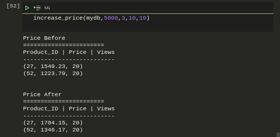

#### 5. 
Find phone numbers and email IDs of all users who reside in the city ‘Madrid’ and have made a total purchase greater than or equal to Rs. 10000 in the past.

**Solution:**

```python

 def find_data(mydb,city,total_purchase):

    query="""
    select C.user_name,C.email,C.phone from 
    (select B.user_name,B.email,B.phone,
    SUM(B.price) total_purchase from
    (select A.*,Products.price from
    (select Users.user_ID,Users.user_name,Users.email,
    Users.phone,Orders.product_ID 
    from Users inner join Orders
    on Users.user_ID = Orders.user_ID
    and Users.city=%s) as A
    inner join Products
    on A.product_ID = Products.product_ID) as B
    group by B.user_name,B.email,B.phone) as C
    where C.total_purchase>%s;
    """
    dbcursor=mydb.cursor()
    dbcursor.execute(query,(city,total_purchase))
    
    for line in dbcursor:
      print(line)
```

```python
find_data(mydb,'Madrid',10000)
```

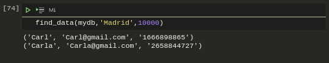


#### 6

Find all products in the database whose name contains the string ‘mi’. E.g. Xiaomi, etc, and all users who bought them at least once.

**Solution:**

```python

def find_data(mydb,word):
    query ="""
    select Name,product_ID 
    from Electronics 
    where 
    Name LIKE %s union all 
    select Name,product_ID 
    from Novels 
    where Name LIKE %s union all 
    select Name,product_ID 
    from Clothes where Name LIKE %s ;
    """

    word = "%"+word+"%"
    dbcursor =mydb.cursor()
    dbcursor.execute(query,(word,word,word))
    
    for line in dbcursor:
        print (line)

```

```python
find_data(mydb,'mi')

```
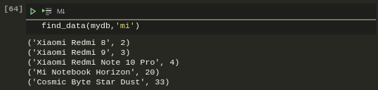

#### 13
 Sort all laptops according to the price in increasing order.

**Solution:**

- SQL Query:

```sql
select Products.product_Name,Products.price,
Products.product_ID 
from Products,Electronics
where (Products.product_ID = Electronics.product_ID 
and Electronics.sub_category="Laptop") 
ORDER BY price DESC;
```

- Python Version:

```python

    def sort_electronics(mydb,sub_category):
    
    query = """
    select Products.product_Name,Products.price 
    from Products,Electronics
    where (Products.product_ID = Electronics.product_ID 
    and Electronics.sub_category=%s) 
    ORDER BY price DESC;

    """
    dbcursor=mydb.cursor()
    dbcursor.execute(query,(sub_category,))
    for line in dbcursor:
        print(line)
```

```python
sort_electronics(mydb,'Laptop')
```

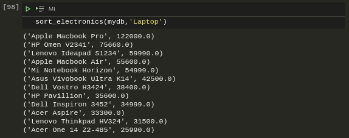

#### 16
 Print the UserId, mobile number, and Email Id of all users who have saved a product in the cart, whose quantity is less than 5.

**Solution:**

```python
 def list_product_cart(mydb,quantity):
    
    query = """
    select Cart.user_ID,Users.phone,
    Users.email
    from Cart,Users where
    Cart.quantity<%s
    and Users.user_ID=Cart.user_ID;

    """
    dbcursor=mydb.cursor()
    dbcursor.execute(query,(quantity,))
    for line in dbcursor:
        print(line)

```

```python
  list_product_cart(mydb,5)
```

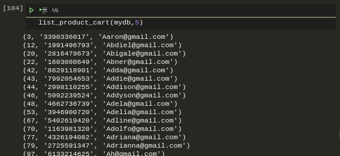

#### 19
List all retailer ids whose products, user_id = 1 have purchased.

**Solution:**

```python
 def list_retailers(mydb,user):
    
    query = """
    select Products.retailer_ID
    from Products inner join
    (select *
    from Orders
    where Orders.user_ID= %s ) as A
    on A.product_ID=Products.product_ID;

    """
    dbcursor=mydb.cursor()
    dbcursor.execute(query,(user,))
    print("Retailer Ids")
    for line in dbcursor:
        print(line)

```

```python
list_retailers(mydb,1)
```
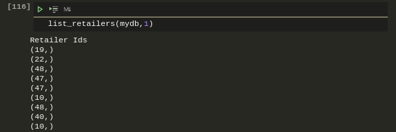

#### 20
Write a query to update the discount on all new products by 15% and store it as a new table holi_Deals. Note: Any product that is added to the database in the last 100 days is considered to be a new product.

**Solution:**
- SQL Query:
  
  ```sql
  CREATE TABLE holi_Deals (
    product_ID int,
    product_Name varchar(50),
    category_ID int,
    date_added date,
    price float(2),
    retailer_ID int);

  INSERT INTO holi_Deals 
  (product_ID,product_Name,category_ID,date_added,price,retailer_ID) 
  SELECT product_ID,product_Name,category_ID,date_added,price*0.85,retailer_ID 
  from Products 
  WHERE date_added >=(DATE(NOW()) - INTERVAL 100 DAY) 
  ORDER BY date_added DESC;

  ```

- Python Version:
  
```python

 def new_deals(mydb,tablename,discount):


    table_create ="""
    CREATE TABLE if not exists {table} (
    product_ID int,
    product_Name varchar(50),
    category_ID int,
    date_added date,
    price float(2),
    retailer_ID int);
    """.format(table=tablename)

    dbcursor = mydb.cursor()
    dbcursor.execute(table_create)
    mydb.commit()
    
    discount_factor = 1-int(discount)/100
    query="""

    INSERT INTO {table}
    (product_ID,product_Name,category_ID,date_added,price,retailer_ID) 
    SELECT product_ID,product_Name,category_ID,date_added,price*%s,retailer_ID 
    from Products 
    WHERE date_added >=(DATE(NOW()) - INTERVAL 100 DAY) 
    ORDER BY date_added DESC;


    """.format(table=tablename)

    dbcursor.execute(query,(discount_factor,))
    mydb.commit()
    dbcursor.execute("select * from {table}".format(table=tablename))
    for line in dbcursor:
        print(line)
```

```python
new_deals(mydb,'holi_Deals','15')
```

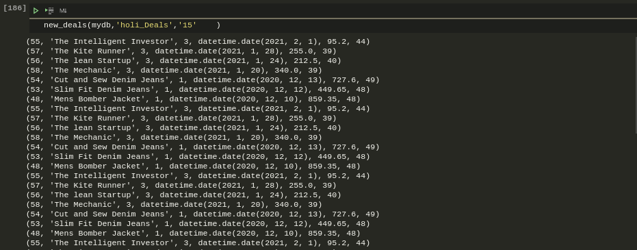

#### 21 
List the top 10 recommended products for the user_id=1 based on the user’s purchase and search history(use any recommendation algorithm).

```python

def list_recommendations(mydb,user_ID):

    query="""
    select Products.product_Name from Orders inner join Products on         Products.product_ID = Orders.product_ID 
    and Orders.user_ID=%s 
    order by Orders.rating DESC limit 10;

    """

    cursor = mydb.cursor()
    cursor.execute(query,(user_ID,))

    for line in cursor:
        print(line)


```

```python
list_recommendations(mydb,1)
```
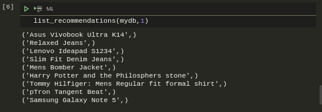

---
<br>

### Problem 2

Assume there is a social network platform named RandomX for movie reviews, where a user can post a review about any movie and give a rating to any movie. To manage all these, we will create a database name RandomX and this database will consist of three schemas. One table will contain all the user details (username, gender, age), the second schema will consist of movie details (movie_id, movie_title, audience_rating), and in the third schema, movies review (movie_id, username, movie_rev) will be there.
For your convenience, all these details are provided in the excel (.xls) files:

- [User Information](https://drive.google.com/file/d/1yCB-ua83fgZrZe_V-5SqmzMnHvdtmOf6/view?usp=sharing): This file consist of dummy user details. 
- [Movie Information](https://drive.google.com/file/d/1mmGgTBCFFMVcl74X0YtHQ-tJSsu09V1w/view?usp=sharing): This file contains all the movie names along with their id and ratings.
- [Movie Reviews](https://drive.google.com/file/d/1f0xLbj83zK0JTIrd-M5A8ucNKd1jEBb3/view?usp=sharing): This file contains all the user reviews of the movie mentioned in the movie information file, along with the username.
Note:  For this question, use a jupyter notebook.

1. Identify the primary keys and all the constraints and then create a database consisting of all the schemas required as per the question. [hint](https://www.w3schools.com/python/python_mysql_create_db.asp) [2 Marks]

2. Insert all the dummy records in the created schemas by reading their respective excel data. [hint: for convenience use pandas library to read excel file] [3 Marks]

3. Add a new column to the movie review table and name it ‘sentiment.’ This sentiment column consists of ‘positive’, ‘negative’, and ‘neutral’ value based on that row’s review. A review is said to be positive if the number of positive words occurring in it is more than the number of negative words, vice-versa for negative, and for neutral, positive word count is equal to negative word count. A list of positive words and negative words is given below, and your task is to update each row’s sentiment cell with the ‘positive’, ‘negative’, or ‘neutral’ value. [7 Marks]

    Positive Words [Link](https://gist.github.com/mkulakowski2/4289437)  and  Negative Words [Link](https://gist.github.com/mkulakowski2/4289441)


4. Show the top 5 movie names with a rating strictly greater than 3.5, and the count of ‘positive’ sentiment is greater than equal to 2 for that movie. [3 Marks]       


**Solution:**

1. Schema:

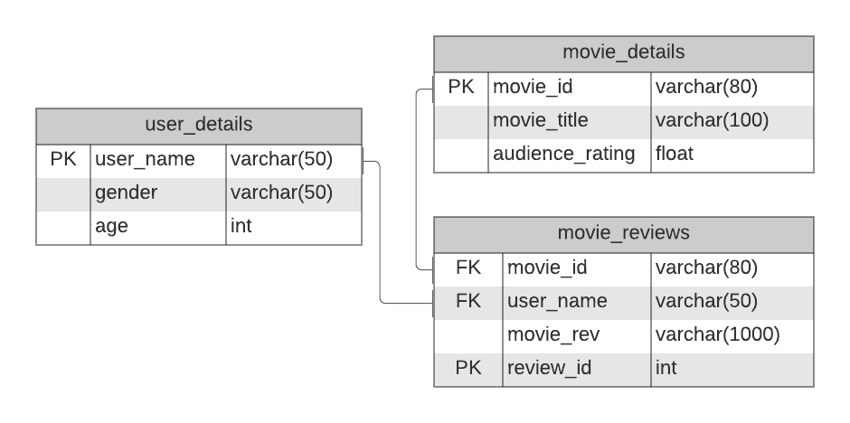

2,3,4. [Jupyter Notebook](./python_scripts/2_problem.ipynb).


- 3 Output
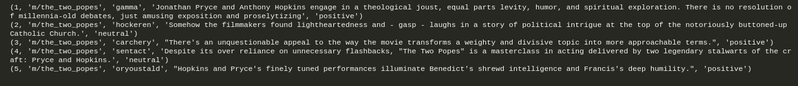
- 4 Output
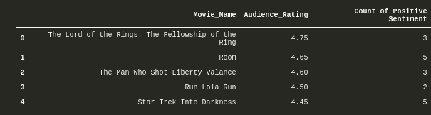

---
<br>

## References:

1. <https://www.kaggle.com/stefanoleone992/rotten-tomatoes-movies-and-critic-reviews-dataset>

2.  Minqing Hu and Bing Liu. "Mining and Summarizing Customer Reviews." ; Proceedings of the ACM SIGKDD International Conference on Knowledge Discovery and Data Mining (KDD-2004), Aug 22-25, 2004, Seattle,;  Washington, USA
   
## Useful Materials:

- Python Library 
  - Python library for interfacing with MySQL (mysql-connector) [[1](https://pypi.org/project/mysql-connector-python/)]
  - Python Mysql Connector [[1](https://dev.mysql.com/downloads/connector/python/)] (required)

- Tutorials
  - Python Programming [[1](https://www.youtube.com/playlist?list=PLQVvvaa0QuDeAams7fkdcwOGBpGdHpXln)] [[2](https://www.youtube.com/playlist?list=PLQVvvaa0QuDe8XSftW-RAxdo6OmaeL85M)]
  - W3School (Python + Mysql) [[1](https://www.youtube.com/watch?v=-YU36D7oTLA&list=PLB5jA40tNf3tRMbTpBA0N7lfDZNLZAa9G&index=2&ab_channel=TheCodex)] (Recommended)
  - Python + Mysql [[1](https://realpython.com/python-mysql/)] (Watch from 2nd video onwards)
  - Real Python (Python + Mysql) [[1](https://realpython.com/python-mysql/)]
  - Mysqltutorial [[1](https://www.mysqltutorial.org/getting-started-mysql-python-connector/)]

- Documentation
  - MySQL Official Documentation [[1](https://dev.mysql.com/doc/connector-python/en/connector-python-examples.html)]

- Input Sanitization
  - It means “checks are performed before the query is executed on the database.”
  - Here is the reason why it is important to do so [[1](https://xkcd.com/327/)]
  - Here is the basic idea of why and how [[1](https://bobby-tables.com/python)]

- Boiler Plate Code/ Starter Code For Database Connection And Input Sanitization
  - Before checking it, do watch tutorials or read documentation to get a complete idea.
  - [Link](https://colab.research.google.com/drive/1krB6HLMMbcnaGhNo9Bz6qEwOv0_U_mxw?usp=sharing)


## Problems Bumped in and Fixes:

1. Access denied to root@local host
   I had lower case and upper case within my orginal password. Created a new user "temp" and gave all the previleges to it with a password "password"[References](https://stackoverflow.com/questions/32852163/accessing-mysql-from-python-3-access-denied-for-user/32853007).
